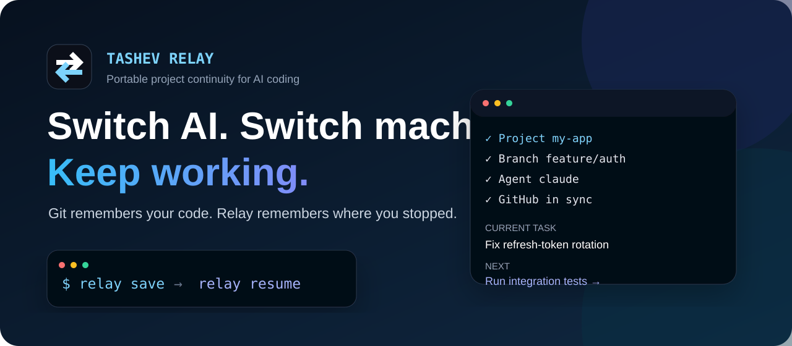
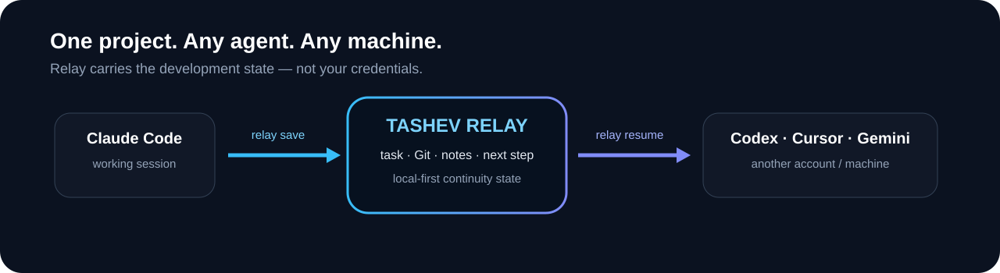
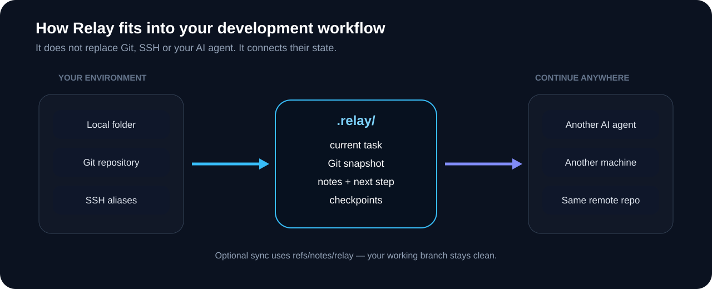
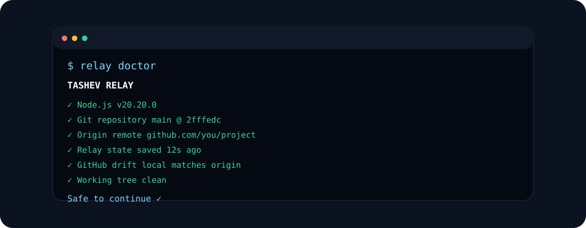
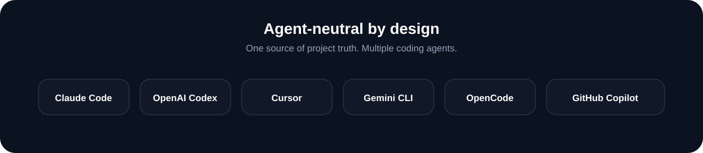

  

# Tashev Relay — русская версия

**Git помнит код. Relay помнит, где вы остановились.**

Tashev Relay — лёгкий local-first CLI для непрерывной AI-разработки. Он сохраняет текущую задачу, Git-состояние, следующий шаг и важные заметки, чтобы можно было переключиться между Claude Code, Codex, Cursor, Gemini CLI, другим аккаунтом, терминалом или компьютером и продолжить работу без повторного разбора всего проекта.

  

## Зачем это нужно

Git сохраняет код и историю commit'ов, но не знает, **что вы сейчас делаете, почему приняли решение, какой AI работал последним, что нельзя ломать и какой следующий шаг**.

Relay хранит эту рабочую память отдельно.

## Быстрый старт

~~~bash
git clone https://github.com/tashev11/tashev-relay.git
cd tashev-relay
npm install -g .

cd your-project
relay init

relay save \
  --task "Исправить обновление токена" \
  --next "Запустить интеграционные тесты" \
  --note "Не менять существующий middleware" \
  --agent claude
~~~

Переключились на другой AI:

~~~bash
relay handoff codex --stdout
relay resume
~~~

## Между компьютерами

~~~bash
# компьютер A
relay sync push

# компьютер B, на том же commit
relay sync pull
relay resume
~~~

Контекст хранится в отдельном <code>refs/notes/relay</code> и не засоряет рабочую ветку.

## Архитектура

  

## Relay Doctor

~~~bash
relay doctor
~~~

  

Проверяет Git, origin, актуальность Relay state, расхождение локального commit с remote, рабочее дерево и опциональные SSH-серверы.

## Поддерживаемые AI

  

Relay создаёт handoff для Claude Code, OpenAI Codex, Cursor, Gemini CLI, OpenCode и GitHub Copilot.

## Безопасность

Relay не читает содержимое .env, приватные SSH-ключи, cookies или файлы авторизации AI. Учётные данные из Git remote URL удаляются, а распространённые токены в заметках маскируются при включённом redactSecrets.

## Основные команды

| Команда | Назначение |
| --- | --- |
| relay init | подключить Relay к проекту |
| relay save | сохранить текущее рабочее состояние |
| relay resume | продолжить с места остановки |
| relay doctor | найти рассинхронизацию |
| relay checkpoint | создать локальную контрольную точку |
| relay handoff &lt;agent&gt; | передать работу другому AI |
| relay sync push/pull | перенести контекст между компьютерами |

Полная документация: [README.md](README.md) · [ROADMAP.md](ROADMAP.md) · [SECURITY.md](SECURITY.md)

---

Если Relay решает вашу проблему — поставьте ⭐ репозиторию. Это помогает проекту расти.

**Git remembers your code. Relay remembers your work.**
